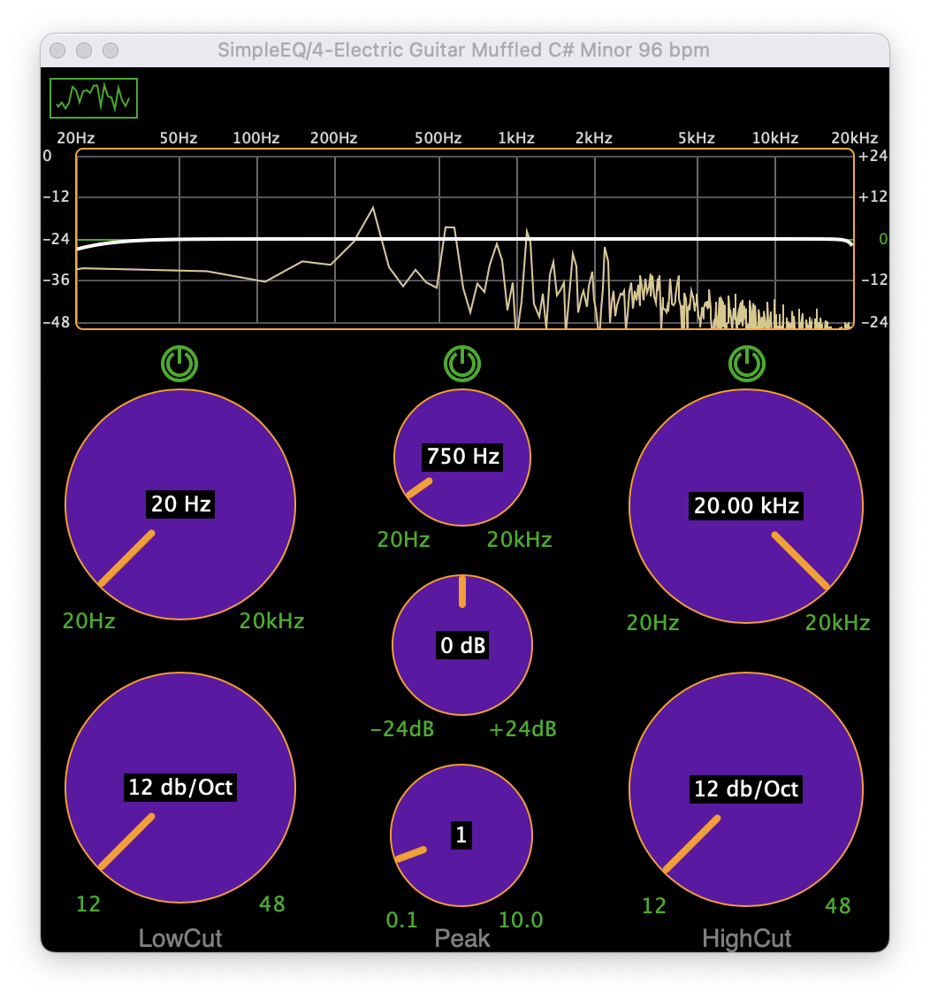

## SimpleEQ

Code Repository for [Learn Modern C++ by Building an Audio Plugin (w/ JUCE Framework) - Full Course](https://www.youtube.com/watch?v=i_Iq4_Kd7Rc) by [Matkat Music](https://www.programmingformusicians.com/)

    

[⬇️ Download SimpleEQ VST Plugin ](https://github.com/Digitopia/SimpleEQ/releases/download/v1/SimpleEQ.vst3.zip)
